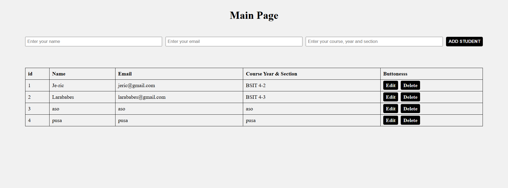
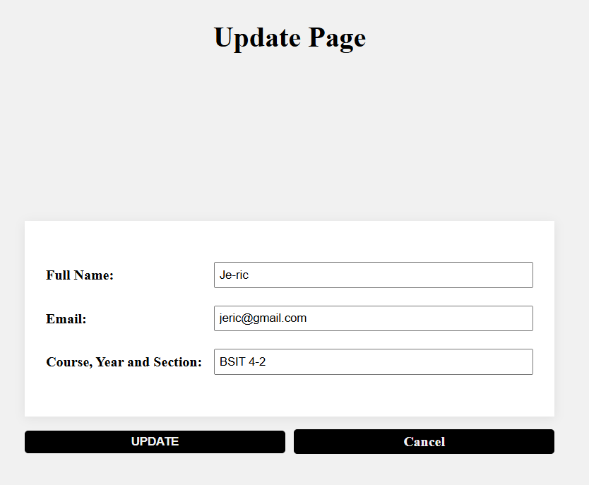
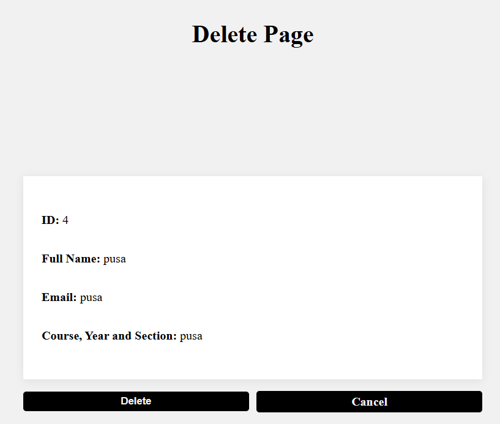

# PHP - OOP (Students CRUD)

Simple PHP OOP CRUD without AJAX. Includes pages for listing, adding, updating, and deleting students using MySQL.

## Features
- Create, Read, Update, Delete students
- Separate pages for Update and Delete with redirects
- Minimal, responsive UI

## Preview (Icons)
- Read: 
- Update: 
- Delete: 

## Tech Stack
- PHP (OOP), MySQL
- Vanilla CSS (`src/style.css`)

## Project Structure
```
/db
  db.php           # DB connection + myDB class (insert/select/update/delete)
  request.php      # Handles form actions and redirects
  oop.sql          # Database schema/seed (database: `oop`)
index.php          # List + add form
update.php         # Edit existing student
delete.php         # Confirm and delete student
/src
  style.css
  img_Read.png
  img_Update.png
  img_Delete.png
```

## Setup
1. Import `db/oop.sql` into MySQL (creates database `oop` and table `tbl_students`).
2. Update `db/db.php` with your DB credentials.
3. Place this folder under XAMPP `htdocs`.
4. Start Apache and MySQL in XAMPP.
5. Open `http://localhost/PHP-Collections/Activities/LAB%20-%20Sir%20Santi/TH1%20-%20(OOP)/`.

## How It Works
- `index.php`
  - Displays table of students from `tbl_students`.
  - Add form posts to `db/request.php` with `add_student`, then redirects back to index.
  - Provides links to `update.php?id=...` and `delete.php?id=...`.
- `update.php`
  - Loads student by `id` (GET), pre-fills a form.
  - On submit, posts to `db/request.php` with `update_student`, then redirects back to index.
- `delete.php`
  - Shows read-only details for confirmation.
  - On submit, posts to `db/request.php` with `delete_student`, then redirects back to index.
- `db/request.php`
  - Performs insert/update/delete through the `myDB` class and issues `header("Location: ../")` redirects.

## Notes
- Required fields: `full_name`, `email`, `course_year_section`.
- After add/update/delete, the page redirects to the main list.

## Troubleshooting
- Blank page or errors: enable PHP error reporting or check Apache error logs.
- Redirect not working: ensure no output is sent before `header()` calls.
- DB connection: update credentials in `db/db.php` and ensure the `oop` database exists.

