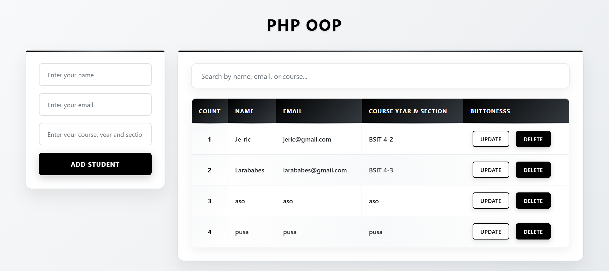
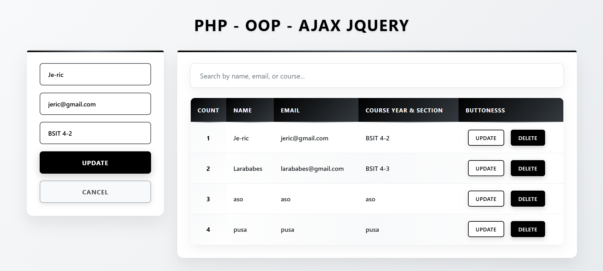
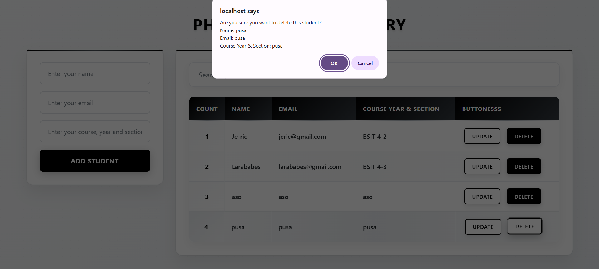

# PHP - OOP - jQuery AJAX (Students CRUD)

A simple CRUD for managing students using PHP OOP, jQuery AJAX, and MySQL.

## Features
- Create, Read, Update, Delete students
- Live, case-insensitive search across all columns
- Update form prefill and cancel
- Simple, responsive table UI

## Preview (Icons)
- Read: 
- Update: 
- Delete: 

## Tech Stack
- PHP (OOP), MySQL
- jQuery (AJAX)
- Vanilla CSS (`src/style.css`)

## Project Structure
```
/db
  db.php           # DB connection + myDB class
  request.php      # AJAX endpoints for CRUD
  oop.sql          # Database schema/seed
/js
  jquery.mins.js   # jQuery
/src
  style.css
  img_Read.png
  img_Update.png
  img_Delete.png
index.php          # UI + JS handlers
```

## Setup
1. Import `db/oop.sql` into MySQL.
2. Update `db/db.php` with your DB credentials (host, user, password, database).
3. Place this folder under XAMPP `htdocs` (already done).
4. Start Apache and MySQL in XAMPP.
5. Open `http://localhost/PHP-Collections/Activities/LAB%20-%20Sir%20Santi/TH2%20-%20(OOP%20w%20jQuery%20AJAX)/`.

## How It Works
- `index.php`
  - `loadStudents()`: AJAX `POST` to `db/request.php` with `get_students` to render rows.
  - Live search: filters rows by substring match on each keystroke.
  - Add: serializes form, `POST add_student`, then reloads table.
  - Update: fills form from row button `data-*` attributes, `POST update_student`.
  - Delete: confirm dialog, `POST delete_student`, then reloads table.
- `db/request.php`: Handles CRUD and echoes JSON for reads.

## API (AJAX POST)
- `get_students`: returns JSON array of students.
- `add_student` + fields: `full_name`, `email`, `course_year_section`.
- `update_student` + fields: `id`, `full_name`, `email`, `course_year_section`.
- `delete_student` + field: `id`.

## Notes
- Search matches all row text (including “Update”/“Delete” labels).
- Consider debouncing search if the dataset grows. Means 
- Style overrides can go in `src/style.css`.